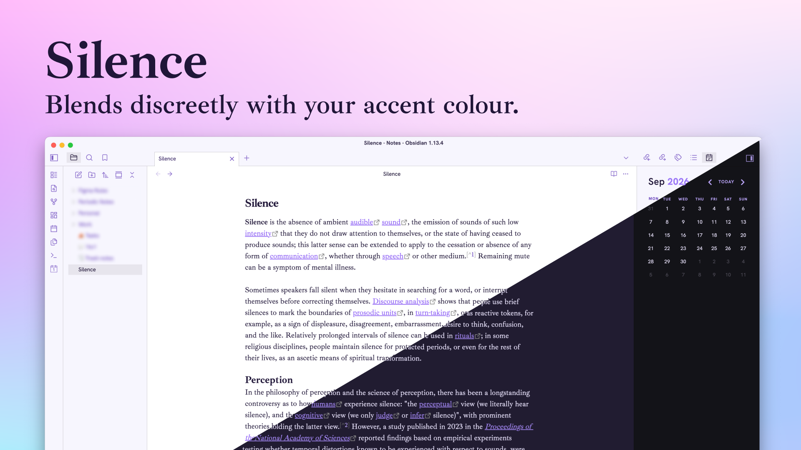

# Silence
**A clean and quiet theme which adapts to the accent color defined in Obsidian**

## Fonts
- UI : [Hanken Grotesk](https://fonts.google.com/specimen/Hanken+Grotesk)
- Notes : [Ibarra Real Nova](https://fonts.google.com/specimen/Ibarra+Real+Nova)

Font sizes harmony is based on 1.06 — Minor Second.
This scale is based on serie inspired by musical intervals which help to create a harmonious and balanced type.

Basically, font-size and line-height are multiple of 1.06.

## Installation from Obsidian Marketplace
1. Open the `Settings` in Obsidian
2. Navigate to `Appearances` tab under Options
3. Under the `Themes` section, click on the `Manage` button across from `Themes`
4. Search for **`Silence`** in the Filter text input
5. Click Use and then you're done

## Style Settings
Keeping light, no option here.

---

Be kind, this is my first theme.